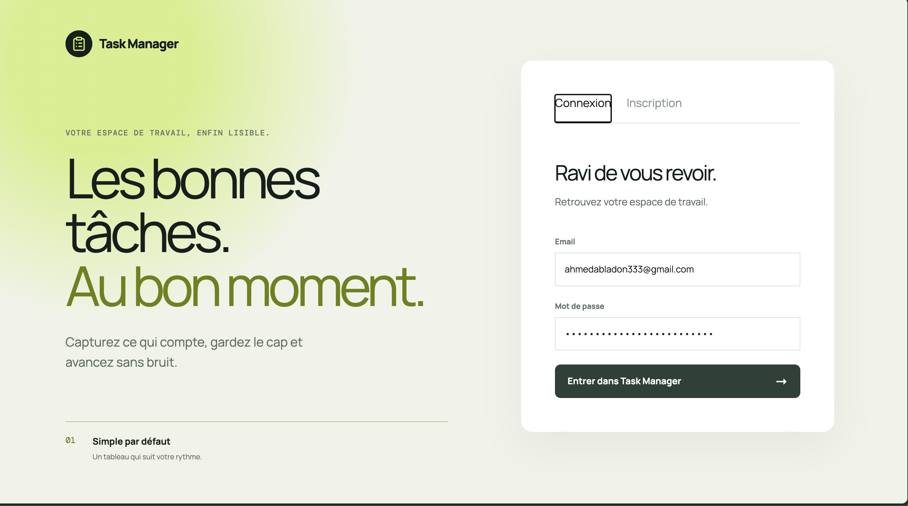
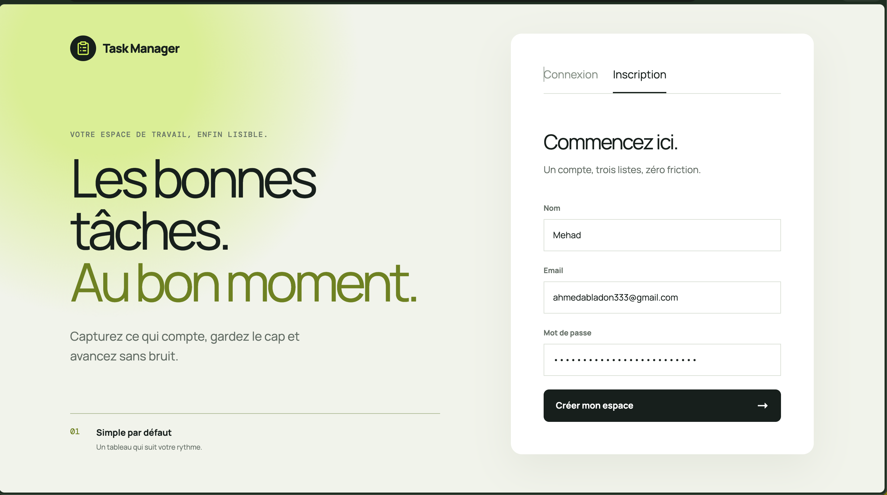
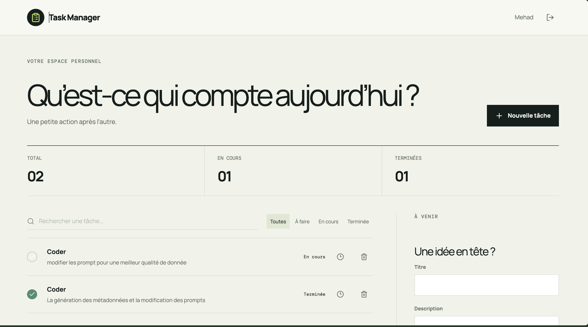
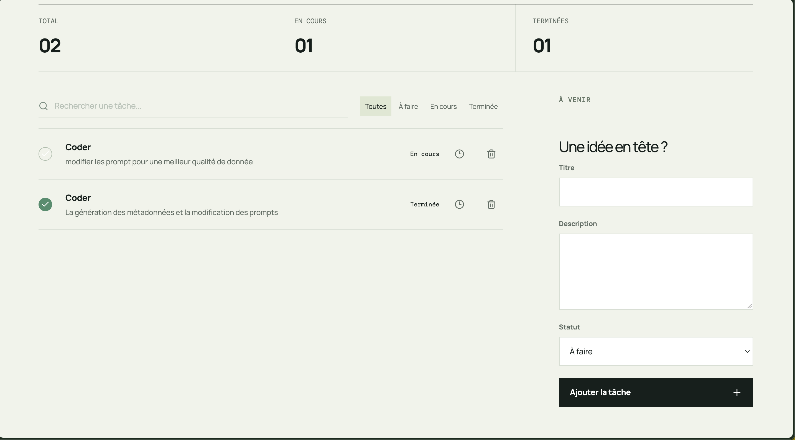

# Task Manager

Monorepo de gestion de tâches avec authentification JWT, interface web responsive et client Flutter bonus.

Repository public : [github.com/Ahmedable33/Task-manager](https://github.com/Ahmedable33/Task-manager)

## Stack

- **Backend** : Spring Boot 3, Java 17, Spring Security, JWT, Spring Data JPA, MySQL 8
- **Frontend** : React 18, Vite, TypeScript, Tailwind CSS, Axios, Lucide
- **Application Task Manager** : Flutter, Dart, Dio, Shared Preferences
- **Ops** : Docker Compose, GitHub Actions, cible de déploiement GCP Cloud Run

## Architecture

```text
frontend (React :5173) ──HTTP/JWT──> backend (Spring :8080) ──JPA──> mysql (:3306)
 Task Manager (Flutter) ──HTTP/JWT──> backend
```

Le backend expose `/api/auth/register`, `/api/auth/login` et les opérations CRUD sous `/api/tasks`. Chaque tâche est reliée à l’utilisateur authentifié; elle ne peut donc être lue ou modifiée par un autre compte.

## Démarrage avec Docker

```bash
docker compose up --build
```

- Web : http://localhost:5173
- API : http://localhost:8081
- MySQL : localhost:3307, base `taskdb`, utilisateur `root`, mot de passe `root`

Ces identifiants sont adaptés au développement local uniquement. En production, fournissez `DB_URL`, `DB_USERNAME`, `DB_PASSWORD`, `JWT_SECRET` et `CORS_ORIGINS` via le secret manager de la plateforme.

## Démarrage sans Docker

Backend, avec Java 17 et Maven installés :

```bash
mvn -f backend/pom.xml spring-boot:run
```

Frontend :

```bash
cd frontend
cp .env.example .env
npm install
npm run dev
```

`VITE_API_URL` pointe par défaut vers `http://localhost:8081`.

Task Manager mobile :

```bash
cd mobile
flutter pub get
flutter run --dart-define=API_URL=http://10.0.2.2:8081
```

Sur un appareil physique, remplacez l’URL par l’adresse IP locale de la machine qui exécute l’API.

## CI/CD

`.github/workflows/ci-cd.yml` s’exécute sur chaque push ou pull request vers `main` et vérifie :

- les tests du backend avec Java 17 et Maven ;
- le build du frontend React avec Node 20 ;
- l’analyse Flutter et la construction de l’APK Android debug ;
- la construction des images Docker backend et frontend.

Dernier run validé : [GitHub Actions](https://github.com/Ahmedable33/Task-manager/actions/runs/35437376253).

Le déploiement Cloud Run reste à configurer avec `google-github-actions/auth`, `setup-gcloud` et des secrets GCP.

## Tests

Tests backend avec Java 17 et Maven via Docker :

```bash
docker run --rm -v "$PWD/backend":/app -w /app maven:3.9.9-eclipse-temurin-17 mvn test
```

Le frontend est vérifié par `npm run build` dans la CI et lors de la construction de son image Docker.

Vérification frontend en local :

```bash
cd frontend
npm ci
npm run build
```

Vérification mobile en local :

```bash
cd mobile
flutter pub get
flutter analyze
flutter build apk --debug
```

Si Flutter signale que `source.properties` manque dans le NDK, réinstallez la version exacte demandée dans le message d’erreur depuis Android Studio SDK Manager ou avec `sdkmanager`.

## Variables d’environnement

| Variable | Service | Valeur locale |
| --- | --- | --- |
| `VITE_API_URL` | frontend | `http://localhost:8081` |
| `DB_URL` | backend | URL JDBC MySQL |
| `DB_USERNAME` / `DB_PASSWORD` | backend | `root` / `root` |
| `JWT_SECRET` | backend | clé d’au moins 32 caractères |
| `JWT_EXPIRATION` | backend | `86400000` ms |
| `CORS_ORIGINS` | backend | `http://localhost:5173` |

## Fonctionnalités mobiles

Le client Flutter prend en charge l’inscription, la connexion JWT, la liste des tâches, le rafraîchissement, la création, la modification, la suppression et la déconnexion.

## Rendu et déploiement

L’interface est accessible depuis `http://localhost:5173` après le démarrage Docker et peut être capturée pour compléter le rendu.

### Captures d’écran

#### Connexion



#### Inscription



#### Tableau de bord



#### Gestion des tâches



### Démonstration vidéo

[Voir la démonstration complète de Task Manager sur Google Drive](https://drive.google.com/file/d/1bfSLaOWSSAe5VTzXJTwGk-tIBUvRyEug/view?usp=sharing)

Aucun lien de production n’est déclaré tant qu’un projet GCP et son domaine ne sont pas configurés.
